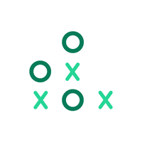

<h1> Portfolio </h1>

## Experience

### Back End Engineer
_Rain - Contract_
 Feb 2020 - Present
 Outsource

---

### Mid-Level Software Engineer
_xWARE Integrated Solutions - Full-time_
 Mar 2019 - Present

---

### Backend Developer
_Freelancing_
 Jun 2018 - Mar 2019

 
 

### Education

### Information Technology Institute (ITI)
_Bachelor's degree_
 .NET Full-Stack Development
 Oct 2018 - Mar 2019

---

### Computer and Information in Asyut, Egypt
_Bachelor's degree_
 .NET Full-Stack Development
 Information System
 Sep 2014 - Jun 2018

